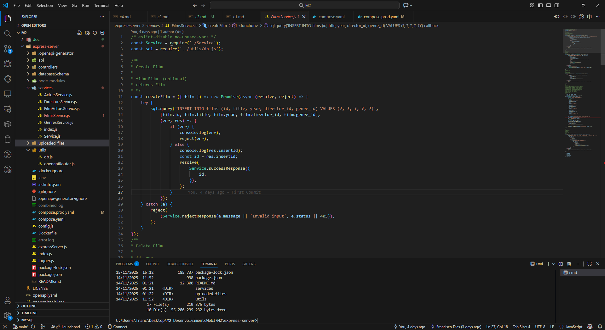

# C3 : Product

## 3.1 Development

**FilmAPI M3** was developed using **LoopBack 4**, a **Node.js framework for building RESTful APIs**.  
The API provides full management of **films, directors, genres, actors**, and **roles**, including **1:n and m:n relations** between resources.

The project follows a **layered architecture** with clear separation of concerns:

| Layer            | Role                                                          |
| ---------------- | ------------------------------------------------------------- |
| Model       | Defines the shape of the data (TypeScript classes) |
| Repository          | Handles database operations and relations |
| Controller | Receives HTTP requests and maps them to repository methods|
| Application    | Bootstraps the LoopBack server and configures datasources|



**Folder structure Overview (Backend)**
````bash
lb4filmapi/
 ├─ src/
 │   ├─ controllers/       # REST API endpoints
 │   ├─ models/            # TypeScript models for all resources
 │   ├─ repositories/      # Database access and relations
 │   ├─ datasources/       # MySQL datasource configuration
 │   ├─ databaseSchema/    # Initial database seeding scripts
 │   └─ application.ts     # Bootstraps the LoopBack app
 ├─ package.json
 └─ ...
````

**System architecture:**

````arduino
Client (React-Admin) → Controller → Repository → Database (MySQL)
````

**Example: Film resource request flow**
````sql
GET /films
      ↓
FilmsController.find()
      ↓
FilmsRepository.find({filter})
      ↓
Query executed on MySQL
      ↓
Result returned as JSON to client

````

## 3.2 React-admin Frontend

The **React-Admin client** is located in the folder:

```bash
filmapi_react_app/
````

It provides a **backoffice interface** to manage all resources exposed by the API. The folder structure is as follows:

```php
filmapi_react_app/
 ├─ src/
 │   ├─ components/
 │   │   ├─ dashboard.js           # Custom dashboard for admin panel
 │   │   └─ resources/             # Resource-specific components
 │   │       ├─ actor/
 │   │       │   ├─ ActorList.js
 │   │       │   ├─ ActorCreate.js
 │   │       │   ├─ ActorEdit.js
 │   │       │   └─ ActorShow.js
 │   │       ├─ director/
 │   │       ├─ film/
 │   │       └─ genre/
 │   ├─ App.js                      # Entry point, routing, admin setup
 │   ├─ index.js                    # React entry point
 │   ├─ index.css                   # Global styles
 │   └─ App.css                     # App-specific styles
 ├─ public/                         # Static assets
 ├─ package.json                    # Dependencies (React, React-Admin)
 └─ Dockerfile                      # Optional containerization

````

**Features implemented in React-Admin:**

-   **CRUD management** for all resources (Films, Directors, Genres, Actors, Roles)

-   Custom resource views:
    
    -   `List` – display multiple records        
    -   `Create` – add new records        
    -   `Edit` – modify existing records        
    -   `Show` – view resource details
        
-   Fully integrated with **LoopBack 4 API** endpoints
-   Supports **filtering, sorting, and pagination** from the frontend  
-   Custom **dashboard** page for resource summary


**Example: Actor resource components**

| Component            | Purpose                                                          |
| ---------------- | ------------------------------------------------------------- |
| ActorList.js       | Displays a list of actors |
| ActorCreate.js          | Form to create a new actor |
| ActorEdit.js | Form to edit existing actor|
| ActorShow.js    | Detailed view of a single actor|


## 3.3 Installation

**Backend (LoopBack 4 API)**

```bash
#Clone the project
git clone https://github.com/inf25dw1g35/inf25dw1g35-lb4.git

#Navigate to the backend folder
cd lb4filmapi

#Install dependencies
npm install
````

Create a `.env` file with:
````ini
DB_HOST=localhost
DB_USER=root
DB_PASSWORD=
DB_NAME=filmapilb4
PORT=3306
````
Import the database:
````bash
mysql -u root -p filmapi < databaseSchema/databaseSchema.sql
````
Start the Loopback 4 server:
````bash
npm run start
````

**Frontend (React-Admin client)**

```bash
#Navigate to the frontend folder
cd filmapi_react_app

#Install dependencies
npm install

#Start React-Admin in development mode
npm start dev
````

The React-Admin client will automatically connect to the backend API.

**Running via Docker**

Development:
````bash
docker compose up --build
````
Production:
````bash
docker compose -f compose.prod.yaml up
````

In this configuration:

-   **Backend container** runs the LoopBack 4 API    
-   **Frontend container** runs the React-Admin client    
-   **MySQL container** provides database persistence

This ensures the **full stack** (API + backoffice client + database) can be run with a single command.

## 3.4 Usage

The API provides **REST endpoints** and supports:

-   Full **CRUD** operations using **POST, GET, PUT,PATCH, DELETE**
-   Filtering, sorting, and pagination via query parameters (`filter`, `where`, `limit`, `offset`)  
-   Automatic **OpenAPI 3.0 documentation** at `/explorer`

**Available endpoints for the Film resource**
````http
GET /films
GET /films/{id}
POST /films
PUT /films/{id}
PATCH /films/{id}
DELETE /films/{id}
````

**Example usage with `curl`**
````bash
#Retrieve all films
curl http://localhost:3000/films

#Create a new film
curl -X POST http://localhost:3000/films \
-H "Content-Type: application/json" \
-d '{"title":"Film 01","year":1920,"director_id":1,"genre_id":1}'
````

**Example response format**
````json
{
  "success": true,
  "data": {
    "id": 3,
    "title": "Film 01",
    "year": 1920,
    "director_id": 1,
    "genre_id": 1
  }
}
````


The **React-Admin client** consumes these endpoints, providing a user-friendly backoffice interface for managing all resources efficiently, without direct API calls.

## 3.5 Implementation details


**Minimum requirements achieved:**

-   Full **CRUD** for all resources: Films, Directors, Genres, Actors 
-   REST API over HTTP using **LoopBack 4**   
-   Fully integrated **React-Admin backoffice** for resource management 
-   MySQL persistence
-   Multi-container Docker setup (Loopback4 + MySQL + React-admin)
-   **OpenAPI 3.0 documentation** generated automatically


**Additional improvements:**    

-   Support for **filters, sorting, pagination** on GET endpoints      
-   Relations: **1:n** (Director → Films) and **m:n** (Film ↔ Actor)

---
[< Previous](c2.md) | [^ Main](../../../) | [Next >](c4.md)
:--- | :---: | ---:

